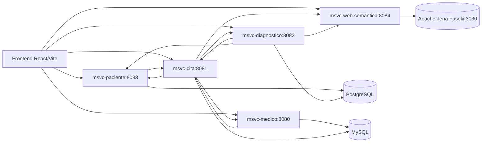
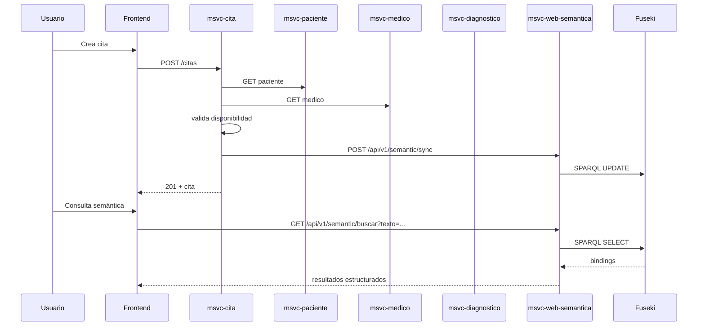

<<<<<<< HEAD
# NOVA_ing-AtencionMedica

Plataforma de gestión clínica basada en microservicios, con una capa de Web Semántica para consultas avanzadas sobre conocimiento médico.

## Propósito y alcance

NOVA integra operaciones clínicas transaccionales con un grafo semántico consultable. El alcance actual cubre:

- Gestión de pacientes, médicos, citas y diagnósticos.
- Integración entre microservicios por HTTP con OpenFeign.
- Sincronización de datos operativos a un grafo RDF/OWL.
- Búsqueda semántica por lenguaje natural y ejecución SPARQL.
- Frontend web para operación clínica y chat semántico.

El objetivo funcional es permitir tanto operaciones CRUD tradicionales como exploración inteligente de datos clínicos.

## Arquitectura del sistema

### Componentes



### Flujos de datos



## Stack tecnológico y versiones

### Backend

- Java 25
- Spring Boot 3.5.9
- Spring Cloud 2025.0.1 (OpenFeign)
- Spring Data JPA
- Spring Validation
- Lombok
- MySQL Connector/J (médico, cita)
- PostgreSQL Driver (paciente, diagnóstico)
- Apache Jena 5.3.0 (msvc-web-semantica)
- Apache Lucene 9.9.1 (msvc-web-semantica)
- OWL API 5.1.20 (msvc-web-semantica)
- Commons Lang 3.18.0

### Frontend

- Node.js 20+ recomendado
- npm 10+ recomendado
- React 18.3.1
- TypeScript 5.8.3
- Vite 6.3.5
- React Router DOM 7.3.0
- Axios 1.13.6
- React Hook Form 7.71.2
- Zustand 5.0.3
- Tailwind CSS 3.4.17

## Instalación paso a paso
### Prerrequisitos

- JDK 25
- Maven 3.9+
- Node.js 20+ y npm
- PostgreSQL activo (puerto 5432)
- MySQL activo (puerto 3306)
- Apache Jena Fuseki activo (puerto 3030) con dataset `atencion_medica`

### 1) Clonar e ingresar al proyecto

```bash
git clone <URL_DEL_REPOSITORIO>
cd Atencion_Medica_MSVC_WS
```

### 2) Backend: instalar dependencias y compilar

```bash
mvn clean install -DskipTests
```

### 3) Levantar microservicios backend

Opción A (Windows):

```powershell
.\run-backend.bat
```

Opción B (manual en terminales separadas):

```bash
cd msvc-medico && mvn spring-boot:run
cd msvc-cita && mvn spring-boot:run
cd msvc-diagnostico && mvn spring-boot:run
cd msvc-paciente && mvn spring-boot:run
cd msvc-web-semantica && mvn spring-boot:run
```

### 4) Levantar frontend

```bash
cd nova-frontend
npm install
npm run dev -- --host
```

## Configuración por entorno

La configuración actual está orientada a desarrollo local con puertos fijos:

- `msvc-medico`: `8080`
- `msvc-cita`: `8081`
- `msvc-diagnostico`: `8082`
- `msvc-paciente`: `8083`
- `msvc-web-semantica`: `8084`

### Desarrollo

- Mantener `application.properties` locales por módulo.
- Usar `spring.jpa.hibernate.ddl-auto=create-drop` en servicios transaccionales para reinicio rápido de datos.
- Ejecutar Fuseki local con dataset `atencion_medica`.

### Staging

- Sobrescribir credenciales por variables de entorno.
- Cambiar `ddl-auto` a `update` o `validate`.
- Configurar URLs de Feign por host real de staging.
- Mantener Fuseki con backup programado.

### Producción

- Inyectar secretos por vault o variables del runtime.
- Usar conexiones TLS, políticas de red y observabilidad centralizada.
- Definir `ddl-auto=validate`.
- Asegurar alta disponibilidad del triplestore y backups.

## Guía de uso con ejemplos prácticos

### Flujo operativo básico

1. Crear médico.
2. Crear paciente.
3. Crear cita.
4. Crear diagnóstico.
5. Ejecutar carga masiva semántica.
6. Consultar por lenguaje natural o SPARQL.

### Ejemplo: crear cita

```bash
curl -X POST http://localhost:8081/citas \
  -H "Content-Type: application/json" \
  -d "{\"fechaCita\":\"2026-03-10\",\"horaInicio\":\"10:00:00\",\"horaFin\":\"10:30:00\",\"motivo\":\"Control\",\"estado\":\"PROGRAMADA\",\"pacienteId\":1,\"medicoId\":1}"
```

### Ejemplo: sincronización semántica masiva

```bash
curl -X POST http://localhost:8084/api/v1/semantic/bulk-load
```

### Ejemplo: consulta en lenguaje natural

```bash
curl "http://localhost:8084/api/v1/semantic/buscar?texto=citas%20de%20cardiologia%20de%20hoy"
```

### Ejemplo: SPARQL directo

```bash
curl -X POST http://localhost:8084/api/v1/semantic/sparql \
  -H "Content-Type: application/json" \
  -d "{\"query\":\"PREFIX med: <http://org.nova.atencion.medica/ontologia#> SELECT ?cita WHERE { ?cita a med:Cita . } LIMIT 10\"}"
```

## Estructura del código

```text
Atencion_Medica_MSVC_WS/
├─ msvc-medico/            # CRUD de médicos + agenda de citas por médico
├─ msvc-paciente/          # CRUD de pacientes + historial clínico
├─ msvc-cita/              # Agenda clínica, validación de solapes y orquestación
├─ msvc-diagnostico/       # Diagnósticos por cita/paciente
├─ msvc-web-semantica/     # RDF/OWL/SPARQL, sync y consultas de lenguaje natural
├─ nova-frontend/          # SPA React con módulos por dominio y chat semántico
├─ documentacion/          # Documentación histórica del proyecto
├─ docs/                   # Documentación técnica actualizada (esta entrega)
├─ run-backend.bat         # Arranque automatizado backend (Windows)
└─ run-frontend.bat        # Arranque frontend (Windows)
```

Mapa detallado por archivo: [docs/estructura-codigo.md](docs/estructura-codigo.md)

## Guía de contribución y estándares

- Usar ramas por feature/fix.
- Mantener arquitectura por capas en backend.
- Evitar romper contratos HTTP existentes.
- Agregar pruebas cuando se cambie lógica de negocio.
- Ejecutar validaciones antes de abrir PR:

```bash
mvn test
cd nova-frontend && npm run lint && npm run check
```

- Seguir estilo Markdown compatible con MarkdownLint: títulos jerárquicos, tablas simples, bloques de código con lenguaje, líneas limpias y enlaces relativos válidos.

Guía completa: [docs/guia-contribucion.md](docs/guia-contribucion.md)

## Documentación técnica completa

- Índice general: [docs/README.md](docs/README.md)
- Arquitectura: [docs/arquitectura/arquitectura-sistema.md](docs/arquitectura/arquitectura-sistema.md)
- Flujos de datos: [docs/arquitectura/flujos-datos.md](docs/arquitectura/flujos-datos.md)
- Módulos backend/frontend: [docs/README.md#módulos](docs/README.md#módulos)
- Funcionalidades transversales: [docs/README.md#funcionalidades-transversales](docs/README.md#funcionalidades-transversales)

## Énfasis de Web Semántica

La capa semántica es el diferenciador del proyecto:

- Transforma datos operativos en conocimiento enlazado (RDF).
- Formaliza vocabulario y restricciones mediante OWL.
- Permite consultas semánticas complejas con SPARQL.
- Ofrece una interfaz de consulta por lenguaje natural orientada a usuarios no expertos.

Documentación específica: [docs/modulos/msvc-web-semantica.md](docs/modulos/msvc-web-semantica.md) y [docs/funcionalidades/consulta-semantica.md](docs/funcionalidades/consulta-semantica.md)
=======
# Page

>>>>>>> 6547abc18b322df2357d81b2d204613dc70171e6
