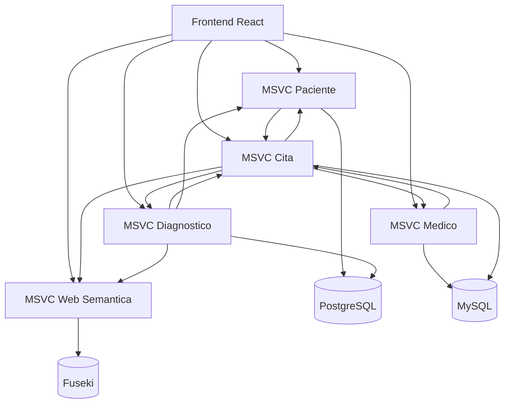

# arquitectura sistema

## Objetivo arquitectónico

NOVA implementa una arquitectura distribuida para desacoplar responsabilidades clínicas por dominio y añadir una capa de conocimiento semántico sobre datos operativos.

## Vista de componentes

## Responsabilidades por componente

* `msvc-paciente`: ciclo de vida del paciente, historial y estado de citas desde perspectiva de paciente.
* `msvc-medico`: gestión de médicos, especialidades y relación operativa con citas.
* `msvc-cita`: orquestador de agenda clínica, validaciones de solape y enriquecimiento con datos cruzados.
* `msvc-diagnostico`: gestión de diagnósticos vinculados a cita/paciente, con sincronización semántica.
* `msvc-web-semantica`: traducción de datos transaccionales a tripletas RDF, consulta SPARQL y búsqueda en lenguaje natural.
* `nova-frontend`: interfaz de operación clínica y exploración semántica.

## Patrones implementados

* Arquitectura por capas en backend (`Controller -> Service -> Repository/Feign Client`).
* Integración síncrona por OpenFeign.
* Persistencia poliglota por dominio (MySQL y PostgreSQL).
* Separación entre modelo transaccional y modelo de conocimiento.

## Decisiones de diseño relevantes

* La semántica no reemplaza el modelo transaccional, lo complementa.
* La sincronización semántica puede ser incremental (`/sync`) o masiva (`/bulk-load`).
* La capa frontend consume contratos REST por proxy de Vite para desacoplar puertos reales.

## Riesgos y mitigaciones

* Riesgo de desalineación de endpoints entre servicios: mantener contratos documentados y pruebas de integración.
* Riesgo de desfase entre datos operativos y grafo: usar carga masiva periódica además de sincronización incremental.
* Riesgo de inconsistencias en ambientes: centralizar variables de entorno y perfiles por entorno.

## Referencias cruzadas

* [Flujos de datos](/broken/pages/92f33195238d0ac9dc8c533e06aa3026abdd0fb5)
* [Integración Feign](/broken/pages/f53bdf00f5a4cb0b3ee033e5d271afebbc62192d)
* [MSVC Web Semántica](/broken/pages/002bbc3fecfe183d4009b0ad4cdddec79fba7e96)
