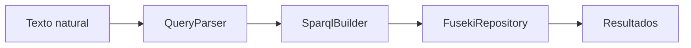

# Consultas semánticas

## Objetivo

Permitir consultas clínicas más expresivas sobre el conocimiento del sistema.

## Pipeline funcional



### Etapas

1. Se parsea el texto para detectar intención y filtros.
2. Se construye SPARQL dinámico.
3. Fuseki ejecuta la consulta.
4. El servicio formatea y devuelve resultados.

## Entradas soportadas

### Lenguaje natural

* Endpoint: `GET /api/v1/semantic/buscar?texto=...`
* Tipo: `texto: String`
* Filtros soportados: DNI, especialidad, estado, fechas, rangos, ranking y disponibilidad.

### SPARQL directo

* Endpoint: `POST /api/v1/semantic/sparql`
* Entrada: `{ query: String }`
* Si falta `query`, la respuesta es `400`.

## Salida

* `List<Map<String,String>>`
* La estructura varía según la consulta construida.

## Ejemplos

### Consulta por especialidad y fecha

```bash
curl "http://localhost:8084/api/v1/semantic/buscar?texto=citas%20de%20cardiologia%20de%20hoy"
```

### Ranking de médicos

```bash
curl "http://localhost:8084/api/v1/semantic/buscar?texto=top%205%20medicos%20con%20mas%20citas"
```

### SPARQL directo

```bash
curl -X POST http://localhost:8084/api/v1/semantic/sparql \
  -H "Content-Type: application/json" \
  -d "{\"query\":\"PREFIX med: <http://org.nova.atencion.medica/ontologia#> SELECT ?d ?tipo WHERE { ?d a med:Diagnostico ; med:tipoDiag ?tipo . } LIMIT 10\"}"
```

## Limitaciones conocidas

* El parser está orientado a patrones definidos.
* No resuelve lenguaje abierto.
* Depende de la disponibilidad de Fuseki.
* Si no hay resultados, el servicio devuelve una excepción semántica con mensaje amigable.

## Recomendaciones

* Usar consultas específicas.
* Evitar consultas demasiado abiertas.
* Mantener gobernanza del vocabulario semántico y los enums transaccionales.
