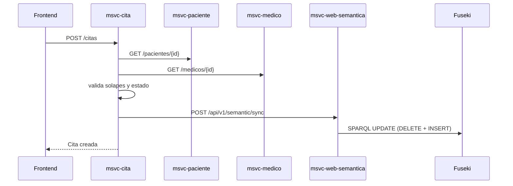
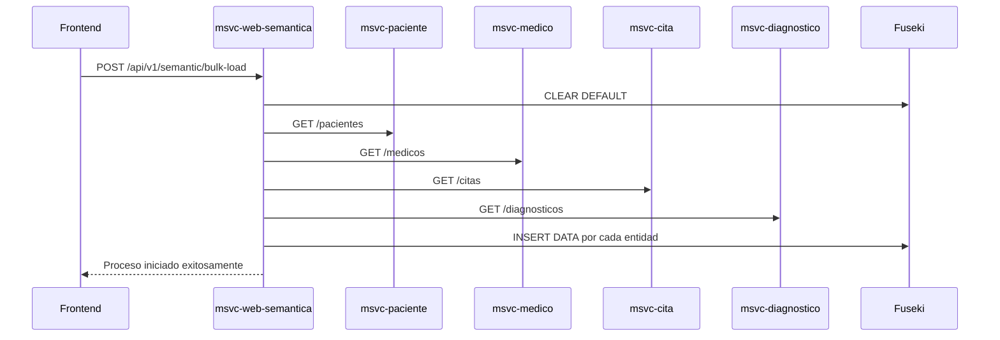

# Flujos de Datos

## Flujo 1: Creación de cita y sincronización semántica



## Flujo 2: Sincronización masiva de conocimiento



## Flujo 3: Consulta semántica en lenguaje natural

```mermaid
sequenceDiagram
    participant FE as Frontend
    participant SEM as msvc-web-semantica
    participant PAR as QueryParser
    participant BLD as SparqlBuilder
    participant FUS as Fuseki

    FE->>SEM: GET /api/v1/semantic/buscar?texto=...
    SEM->>PAR: parse(texto)
    PAR-->>SEM: filtros/intención
    SEM->>BLD: buildSearchQuery(parseResult)
    BLD-->>SEM: SPARQL
    SEM->>FUS: executeSelect(query)
    FUS-->>SEM: bindings
    SEM-->>FE: lista de resultados
```

## Puntos críticos del flujo

- `msvc-cita` es punto de consistencia operativa (valida disponibilidad y activa sincronización semántica).
- `msvc-web-semantica` es punto de consistencia semántica (reescribe tripletas de cita/paciente/médico).
- El frontend abstrae puertos internos mediante proxy en `vite.config.ts`.

## Buenas prácticas operativas

- Ejecutar `/bulk-load` al iniciar ambiente de desarrollo o luego de carga masiva de datos.
- Usar `/sync` por evento de negocio para minimizar desfase semántico.
- Registrar errores de Fuseki y degradar con mensaje de usuario si la consulta falla.

## Referencias cruzadas

- [Arquitectura del sistema](arquitectura-sistema.md)
- [Consulta semántica](../funcionalidades/consulta-semantica.md)
- [msvc-cita](../modulos/msvc-cita.md)
