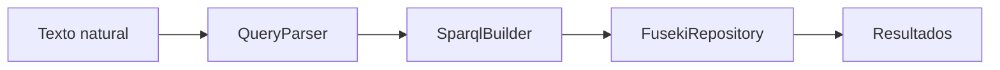

# Consulta Semántica y Lenguaje Natural

## Propósito

Explicar cómo el proyecto implementa Web Semántica para convertir datos clínicos en conocimiento consultable por SPARQL y lenguaje natural.

## Fundamento semántico

La ontología `atencion-medica.ttl` define clases, propiedades y restricciones del dominio:

- Clases: `med:Paciente`, `med:Medico`, `med:Cita`, `med:Diagnostico`.
- Propiedades de datos: DNI, nombres, especialidad, fecha/estado de cita, descripción diagnóstica.
- Propiedades de objeto: `med:citaAgendadaPara`, `med:atendidaPor`, `med:generaDiagnostico`.
- Restricciones OWL: cardinalidad calificada para asegurar una relación médico/paciente por cita.

## Pipeline funcional



### Etapas

1. Parseo del texto de consulta para identificar intención y filtros.
2. Construcción de SPARQL dinámico.
3. Ejecución SELECT en Fuseki.
4. Formateo y retorno de resultados para frontend.

## Entrada/salida de la funcionalidad

### Entrada

- Endpoint: `GET /api/v1/semantic/buscar?texto=...`
- Tipo: `texto: String`
- Filtros soportados: DNI, especialidad, estado, fechas, rangos, ranking, disponibilidad.

### Salida

- Tipo: `List<Map<String,String>>`
- Estructura dinámica según consulta construida.

## Ejemplos ejecutables

### Consulta por especialidad y fecha

```bash
curl "http://localhost:8084/api/v1/semantic/buscar?texto=citas%20de%20cardiologia%20de%20hoy"
```

### Ranking de médicos

```bash
curl "http://localhost:8084/api/v1/semantic/buscar?texto=top%205%20medicos%20con%20mas%20citas"
```

### SPARQL directo

```bash
curl -X POST http://localhost:8084/api/v1/semantic/sparql \
  -H "Content-Type: application/json" \
  -d "{\"query\":\"PREFIX med: <http://org.nova.atencion.medica/ontologia#> SELECT ?d ?tipo WHERE { ?d a med:Diagnostico ; med:tipoDiag ?tipo . } LIMIT 10\"}"
```

## Casos de uso reales

- Soporte a decisiones rápidas de agenda por especialidad/estado.
- Exploración de patrones clínicos por rango temporal.
- Análisis agregado para gestión médica.

## Limitaciones conocidas

- El parser está orientado a patrones de lenguaje definidos, no a comprensión abierta.
- Dependencia directa de disponibilidad de Fuseki.
- Si no hay resultados, el servicio devuelve una excepción semántica con mensaje amigable.

## Recomendaciones de mejores prácticas

- Ejecutar `bulk-load` al iniciar ambientes.
- Usar consultas específicas para reducir costo de ejecución.
- Mantener gobernanza de vocabulario semántico y enums transaccionales.

## Referencias cruzadas

- [MSVC Web Semántica](../modulos/msvc-web-semantica.md)
- [Flujos de datos](../arquitectura/flujos-datos.md)
- [Arquitectura del sistema](../arquitectura/arquitectura-sistema.md)
