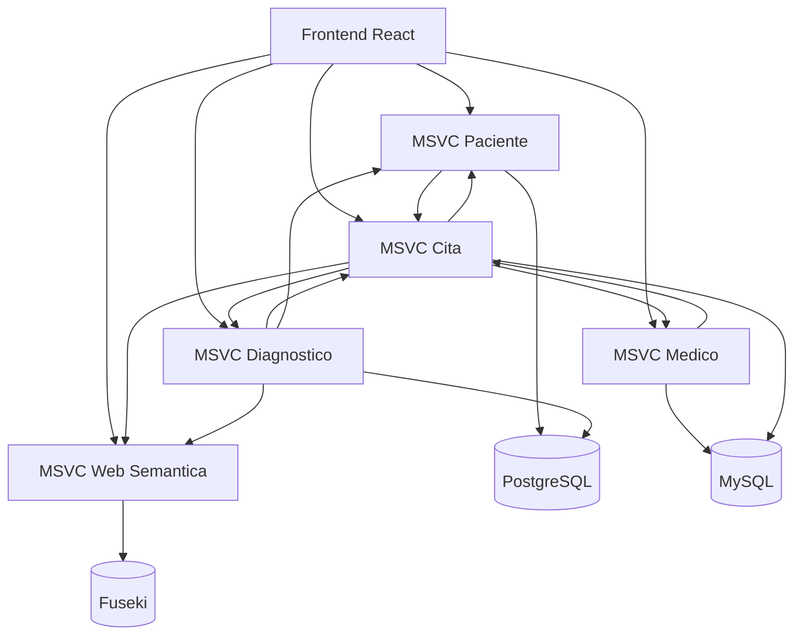

# Arquitectura del sistema

## Objetivo arquitectónico

NOVA implementa una arquitectura distribuida. El objetivo es desacoplar responsabilidades clínicas por dominio y añadir una capa de conocimiento semántico.

### Vista de componentes

### Responsabilidades por componente

* `msvc-paciente`: ciclo de vida del paciente e historial desde su perspectiva.
* `msvc-medico`: gestión de médicos y especialidades.
* `msvc-cita`: validación de agenda, solapes y enriquecimiento de respuestas.
* `msvc-diagnostico`: diagnósticos vinculados a cita y paciente.
* `msvc-web-semantica`: RDF, SPARQL y lenguaje natural.
* `nova-frontend`: interfaz de operación clínica y exploración semántica.

### Patrones que aparecen en el proyecto

* Backend por capas: `Controller -> Service -> Repository/Feign Client`.
* Integración síncrona mediante OpenFeign.
* Persistencia políglota por dominio.
* Separación entre datos operativos y conocimiento.


La capa semántica no reemplaza al modelo transaccional. Lo complementa.


### Persistencia por módulo

* `msvc-medico`: MySQL.
* `msvc-cita`: MySQL.
* `msvc-paciente`: PostgreSQL.
* `msvc-diagnostico`: PostgreSQL.
* `msvc-web-semantica`: Apache Jena Fuseki.

### Riesgos ya visibles en el diseño

* Desalineación de endpoints entre servicios.
* Desfase entre datos operativos y grafo semántico.
* Cascadas por integración síncrona en rutas compuestas.
* Diferencias entre ambientes si no se centralizan variables.

### Mitigaciones documentadas

* Mantener contratos claros entre servicios.
* Ejecutar carga masiva cuando el grafo pueda quedar desactualizado.
* Revisar conectividad y configuración por ambiente.
* Limitar consultas abiertas y llamadas encadenadas frecuentes.
