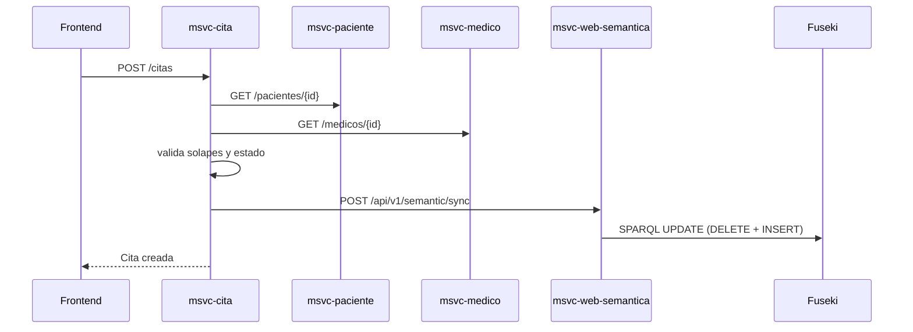
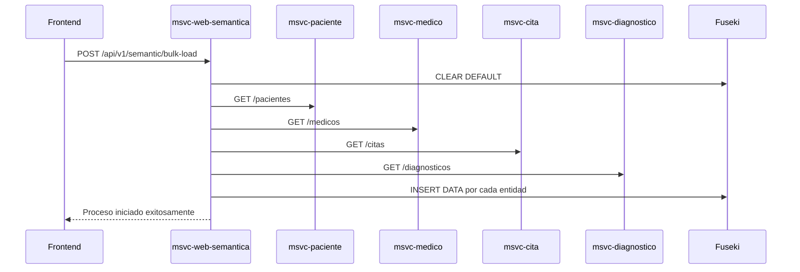

# Flujos principales

## Flujo 1: creación de cita y sincronización semántica



### Qué ocurre aquí

1. El frontend envía la cita.
2. `msvc-cita` valida paciente y médico.
3. `msvc-cita` valida disponibilidad y estado.
4. Si persiste la cita, sincroniza la capa semántica.
5. Fuseki reescribe las tripletas afectadas.

## Flujo 2: sincronización masiva de conocimiento



### Cuándo usarlo

* Tras cambios de datos históricos.
* Tras restauraciones.
* Al iniciar ambientes de desarrollo.
* Cuando falle la sincronización incremental.

## Flujo 3: consulta semántica en lenguaje natural

```mermaid
sequenceDiagram
    participant FE as Frontend
    participant SEM as msvc-web-semantica
    participant PAR as QueryParser
    participant BLD as SparqlBuilder
    participant FUS as Fuseki

    FE->>SEM: GET /api/v1/semantic/buscar?texto=...
    SEM->>PAR: parse(texto)
    PAR-->>SEM: filtros/intención
    SEM->>BLD: buildSearchQuery(parseResult)
    BLD-->>SEM: SPARQL
    SEM->>FUS: executeSelect(query)
    FUS-->>SEM: bindings
    SEM-->>FE: lista de resultados
```

### Lectura rápida del flujo

* El usuario no escribe SPARQL.
* El parser identifica intención y filtros.
* El builder genera la consulta.
* Fuseki ejecuta la búsqueda.
* El servicio devuelve resultados estructurados.


`msvc-cita` es el punto central de consistencia operativa. `msvc-web-semantica` es el punto central de consistencia semántica.


### Buenas prácticas operativas

* Usar `/sync` por evento de negocio.
* Ejecutar `/bulk-load` si hay dudas sobre el estado del grafo.
* Registrar errores de Fuseki y degradar con mensajes claros.
